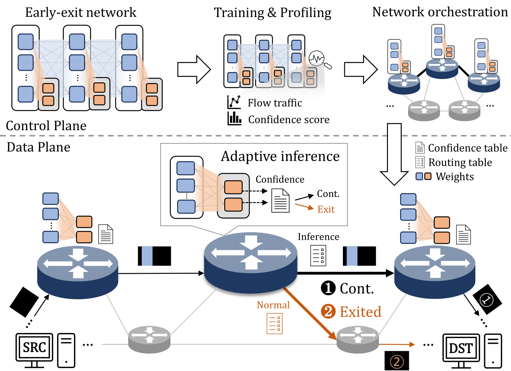

# TINIEE: Traffic-Aware Adaptive In-Network Intelligence via Early-Exit Strategy

## Overview of TINIEE

<p align="center">


TINIEE implements deep neural network (DNN) models with early-exit strategies in programmable data planes (PDP). By leveraging intermediate classifiers within the DNN, it dynamically evaluates confidence scores at each switch to decide whether packets should exit early or proceed to subsequent layers. This adaptive mechanism effectively balances network traffic management and inference accuracy.


## Folder Structure

### `p4src`
Contain P4 code files for the TINIEE, DINC, and NNsplit methods. Each file implements the data plane logic of its respective method.

### `rule`
Store topology-specific model rules for the Italian, NSFNET, and Japanese environments. These rules guide the behavior of each method within the defined topologies.

### `packets`
Handle the core functionality of the network, including:
- Packet transmission and reception.
- Mininet environment setup.
- Result computation and network execution logic.

### `result` & `temp_result`
- **`result`**: Contain packet delay and inference results based on topology and confidence threshold.
- **`temp_result`**: Contain raw intermediate files that are processed to generate `result`.

### `Topology_solution`
Contain model placement results in the control plane for TINIEE and DINC. These results are used to deploy models onto Bmv2 switches.

## Dependencies
To run the code, basic dependencies such as `p4c`, `Bmv2`, and `Mininet` should be installed. It is strongly recommended to place these dependencies identically in the home directory. Detailed installation instructions can be found at the following links:

- **p4c**: [https://github.com/p4lang/p4c](https://github.com/p4lang/p4c)
- **Bmv2**: [https://github.com/p4lang/behavioral-model](https://github.com/p4lang/behavioral-model)
- **Mininet**: [https://github.com/mininet/mininet](https://github.com/mininet/mininet)

## Execution Steps

### Clone Repository
```bash
git clone https://github.com/keemeew/TINIEE
```
### Execute P4 Programs
Use the following `make` commands to execute specific topologies and methods. The general format is:
```bash
make {Topology}_{Method}_{Confidence Threshold}
```

#### Available Options
- **Topologies**: `ITA` (Italian), `NSF` (NSFNET), `JPN` (Japanese)
- **Methods**: `TINIEE`, `DINC`, `NNsplit`
- **Confidence Thresholds**: `0.55`, `0.60`, `0.65`, `0.70`, `0.75`, `0.80`, `0.85`, `0.90`, `0.95`

#### Example Command for TINIEE
To execute the TINIEE method with the Italian topology and a threshold of 0.55:
```bash
make ITA_EE_55
```
### Clean Up
To stop and clean the environment:
```bash
make clean
```
