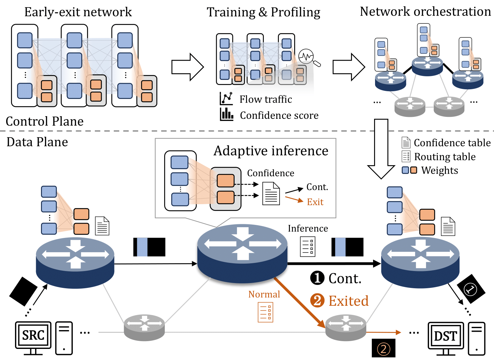
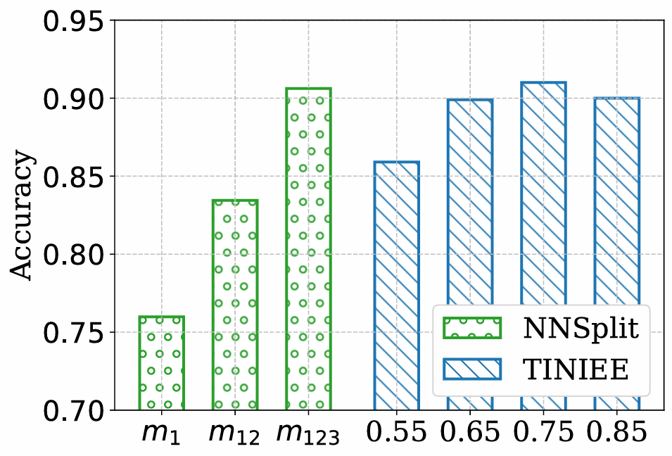
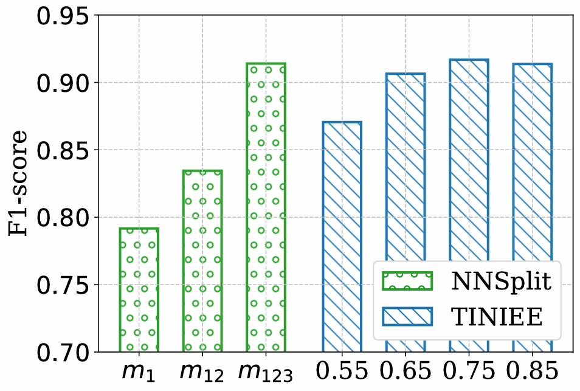
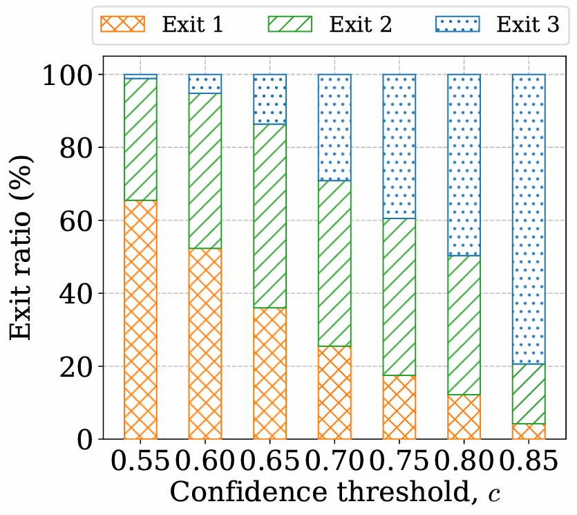
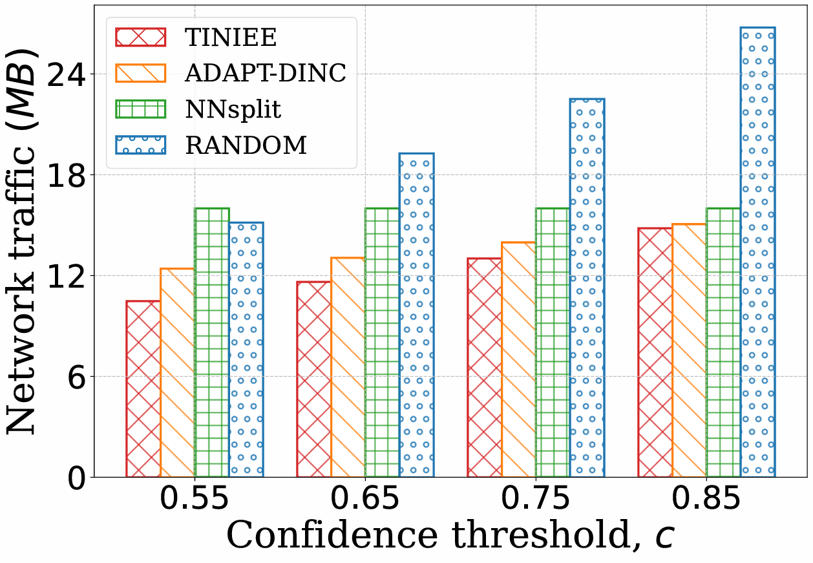
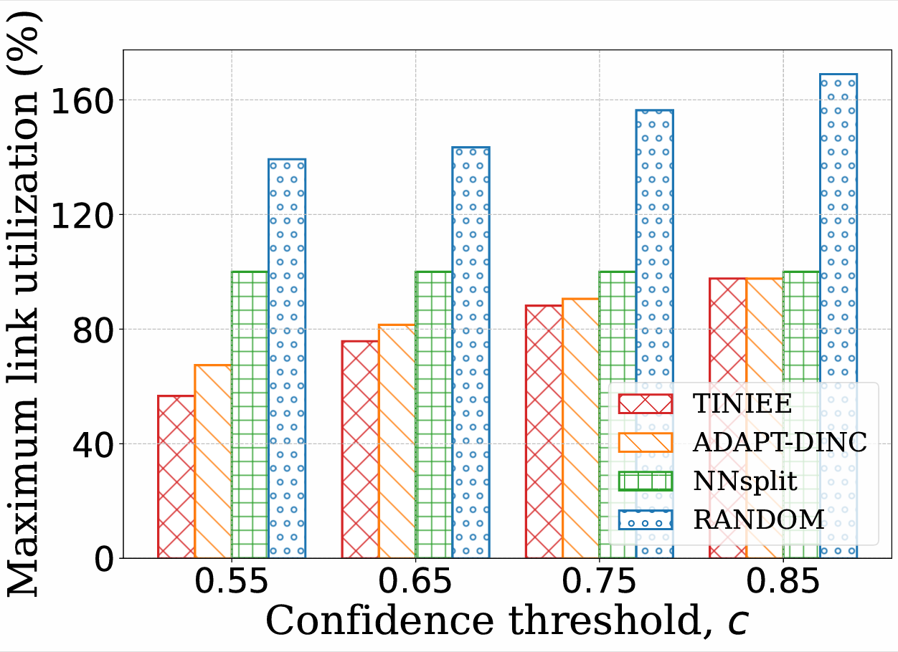
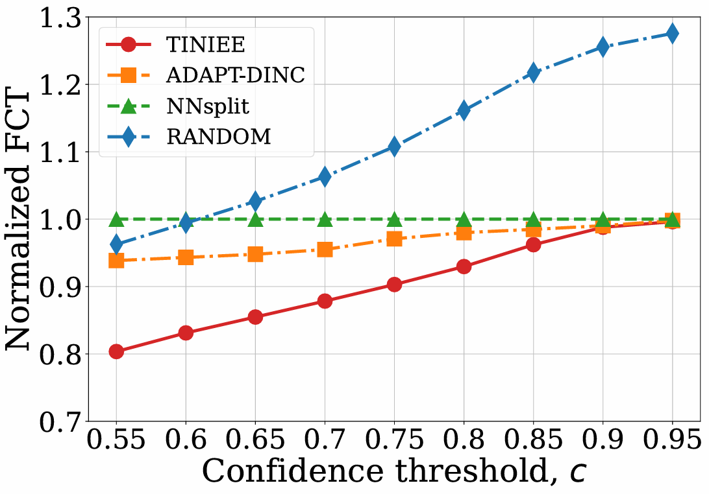
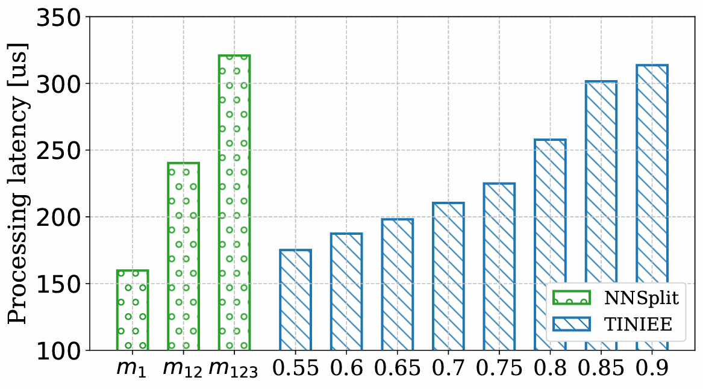

# TINIEE: Traffic-Aware Adaptive In-Network Intelligence via Early-Exit Strategy

## Overview of TINIEE

TINIEE implements deep neural network (DNN) models with early-exit strategies in programmable data planes (PDP). By leveraging intermediate classifiers within the DNN, it dynamically evaluates confidence scores at each switch to decide whether packets should exit early or proceed to subsequent layers. This adaptive mechanism effectively balances network traffic management and inference accuracy.

# Performance Results

## BMv2 environments
### In-Network Classification Performances
<table>
  <tr>
    <td align="center"></td>
    <td align="center"></td>
    <td align="center"></td>
  </tr>
  <tr>
    <td align="center">Accuracy</td>
    <td align="center">F1-score</td>
    <td align="center">Exit Tendency</td>
  </tr>
</table>

### Network Performances
<table>
  <tr>
    <td align="center"></td>
    <td align="center"></td>
    <td align="center"></td>
  </tr>
  <tr>
    <td align="center">Network Traffic</td>
    <td align="center">Maximum Link Utlization</td>
    <td align="center">Flow Completion Time</td>
  </tr>
</table>

## Tofino environments
### Topology
This is the topology used during the performance evaluation of TINIEE on the Tofino:

Traffic was generated and sent by host1 towards host2, with each switch running three submodels of TINIEE. Note that three submodels are actually deployed in the single Wedge100BF 32X Tofino switch, but logically separated by allocating different ports.

### Performance
<table>
  <tr>
    <td align="center"></td>
  </tr>
  <tr>
    <td align="center">Processing Delays</td>
  </tr>
</table>
